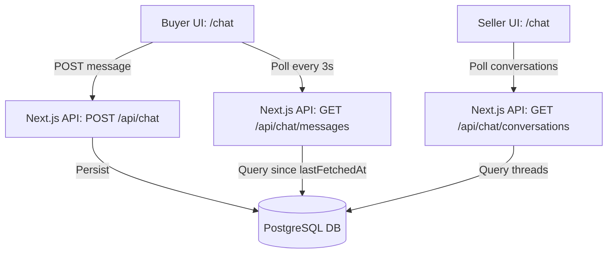

# Chat & Contact System Design Specification
## Real Estate Marketplace MVP

This document details the architectural specifications, API signatures, and realtime workflows for the lightweight property-linked messaging system.

---

### 1. Chat Architecture

A lightweight client-server polling architecture that fits into the Next.js App Router and PostgreSQL persistence model.



---

### 2. Database Schema

The database utilizes the existing `Message` model in `schema.prisma` which links a conversation context to a specific property listing:

```prisma
model Message {
  id         String    @id @default(dbgenerated("gen_random_uuid()")) @db.Uuid
  senderId   String    @db.Uuid
  sender     User      @relation("SentMessages", fields: [senderId], references: [id], onDelete: Cascade)
  receiverId String    @db.Uuid
  receiver   User      @relation("ReceivedMessages", fields: [receiverId], references: [id], onDelete: Cascade)
  propertyId String?   @db.Uuid
  property   Property? @relation(fields: [propertyId], references: [id], onDelete: SetNull)
  content    String
  createdAt  DateTime  @default(now())
  updatedAt  DateTime  @updatedAt

  @@index([senderId, receiverId])
  @@index([propertyId])
}
```

---

### 3. Messaging Workflow

1.  **Initiation**: A buyer visits a property details page (`/listings/[id]`) and clicks **Send Message**.
2.  **Navigation**: The buyer is redirected to `/chat?propertyId={propertyId}&receiverId={ownerId}`.
3.  **Thread Setup**: The frontend parses the query parameters and prepares a new chat pane:
    *   If a conversation history already exists between them for this property, it is loaded.
    *   If no history exists, a temporary chat window is rendered with a "Send your first message" invitation.
4.  **Exchange**: When a message is sent, the API validates the sender session, saves it, and returning the new database message row.
5.  **Synchronization**: Polling pulls new messages, dynamically updating the viewport.

---

### 4. API Routes

All endpoints require active user sessions via NextAuth.

#### A. POST `/api/chat`
Sends a message to another user linked to a property.

*   **Request Body**:
    ```json
    {
      "receiverId": "f7d75b31-e123-...",
      "propertyId": "0cdcd376-084b-...", // Optional
      "content": "Hi, is this property still available for viewing?"
    }
    ```
*   **Response (200 OK)**:
    ```json
    {
      "success": true,
      "message": "Message sent",
      "data": {
        "id": "e81d7f45-...",
        "content": "Hi, is this property still available for viewing?",
        "senderId": "user-uuid...",
        "receiverId": "f7d75b31-...",
        "propertyId": "0cdcd376-...",
        "createdAt": "2026-06-02T04:15:00Z"
      }
    }
    ```

#### B. GET `/api/chat/conversations`
Fetches a list of active conversation threads for the logged-in user, grouped by other participant and property context.

*   **Response (200 OK)**:
    ```json
    {
      "success": true,
      "data": [
        {
          "otherParticipant": {
            "id": "f7d75b31-...",
            "name": "Sarah Jenkins",
            "image": "...",
            "isVerified": true
          },
          "property": {
            "id": "0cdcd376-...",
            "title": "Luxury Villa",
            "price": 15000000,
            "imageUrl": "..."
          },
          "lastMessage": {
            "content": "Hi, is this property still available for viewing?",
            "createdAt": "2026-06-02T04:15:00Z",
            "senderId": "user-uuid..."
          }
        }
      ]
    }
    ```

#### C. GET `/api/chat/messages`
Retrieves detailed message logs between the logged-in user and another user.

*   **Query Parameters**:
    *   `otherId` (UUID, Required): ID of the other user.
    *   `propertyId` (UUID, Optional): Scopes chat to a specific listing.
    *   `since` (ISO Date string, Optional): Retrieves messages created *after* this timestamp for optimized polling updates.
*   **Response (200 OK)**:
    ```json
    {
      "success": true,
      "data": [
        {
          "id": "e81d7f45-...",
          "content": "Hi, is this property still available for viewing?",
          "senderId": "buyer-uuid...",
          "createdAt": "2026-06-02T04:15:00Z"
        }
      ]
    }
    ```

---

### 5. Realtime Strategy: Lightweight Timestamp Polling

Instead of implementing heavy WebSockets servers (which increase deployment complexity and require persistent memory configurations on host platforms), we utilize **Timestamp Polling**:

1.  **First Load**: Load the initial history (e.g. last 50 messages). Record the timestamp of the latest message as `lastFetchedAt`.
2.  **Interval Request**: Every **3 seconds**, hit `GET /api/chat/messages?otherId={otherId}&propertyId={propertyId}&since={lastFetchedAt}`.
3.  **Delta Application**:
    *   If the database returns new rows:
        *   Append the new messages to the local message array state.
        *   Scroll to the bottom of the viewport.
        *   Update `lastFetchedAt` to the timestamp of the newest message.
    *   If no records return, do nothing (keep payload near 0 bytes).
4.  **Lifecycle Management**: Pause polling when the document is hidden (`document.visibilityState === "hidden"`) or the user focuses away from the tab. Resume instantly on re-focus.

---

### 6. Frontend Chat UI

A clean split-pane UI matching the marketplace's premium look:

*   **Sidebar (Left 1/3)**: Scrollable list of active threads. Includes:
    *   Participant avatars and legal name verification badges.
    *   Property thumbnail images, titles, and price values.
    *   Last message preview text (truncated) and relative timestamps (e.g. `2m ago`).
*   **Chat Workspace (Right 2/3)**:
    *   **Header Section**: Details of the current recipient (name, role) and a hoverable property contextual summary block showing listing details.
    *   **Message Feed**: Bubble-styled message containers (indigo for outgoing, dark/light slate for incoming) with timestamps.
    *   **Input Area**: Textarea with auto-expanding height, enter-to-submit support, and active loading/submitting states.

---

### 7. Security Recommendations

*   **Authentication Guards**: NextAuth session verification on all API route files. No database writes are allowed with spoofed sender IDs.
*   **Message Read/Write Authorization**:
    *   When retrieving chat history, verify that `session.user.id === senderId` or `session.user.id === receiverId`.
    *   Users are blocked from reading conversations where they are not participants.
*   **Input Sanitization**: Escape user text content before saving to prevent HTML/script injection inside chat bubbles.
*   **Rate Limiting**: Apply API rate limiting on `/api/chat` (e.g., max 30 messages/minute) to prevent automated script spam.

---

### 8. Notification Strategy

*   **Document Title Alerts**: When new messages are received while the browser tab is inactive, prefix the HTML document title with a badge: `(1) New Message | Heisnam Estate`.
*   **Unread Count Badge**: Render a numerical counter in the primary marketplace navbar to prompt users to check their `/chat` inbox.

---

### 9. Error Handling

*   **Send Failure Retries**: If a message fails to post due to network timeouts:
    *   Mark the bubble with a red warning badge: *"Failed to send"*.
    *   Provide a click-to-retry link that resubmits the message.
*   **Offline Indicator**: Monitor connection status using the `window.addEventListener("offline")` listener, displaying a banner: *"Connection lost. Retrying..."* while pausing polling.

---

### 10. Optimization Recommendations

*   **Composite Indexing**: Ensure composite database indexes are active on search parameters:
    ```sql
    CREATE INDEX IF NOT EXISTS idx_messages_participants_created ON "Message" (senderId, receiverId, "createdAt" DESC);
    ```
*   **Lightweight Response Payload**: Select only `id`, `content`, `senderId`, `createdAt` when loading history, omitting heavy relations to keep network payloads under 1KB.
*   **Polling Frequency Throttle**: Slow down the polling interval to 10 seconds if no message is received for 5 minutes, and scale it back to 3 seconds when the user begins typing.
