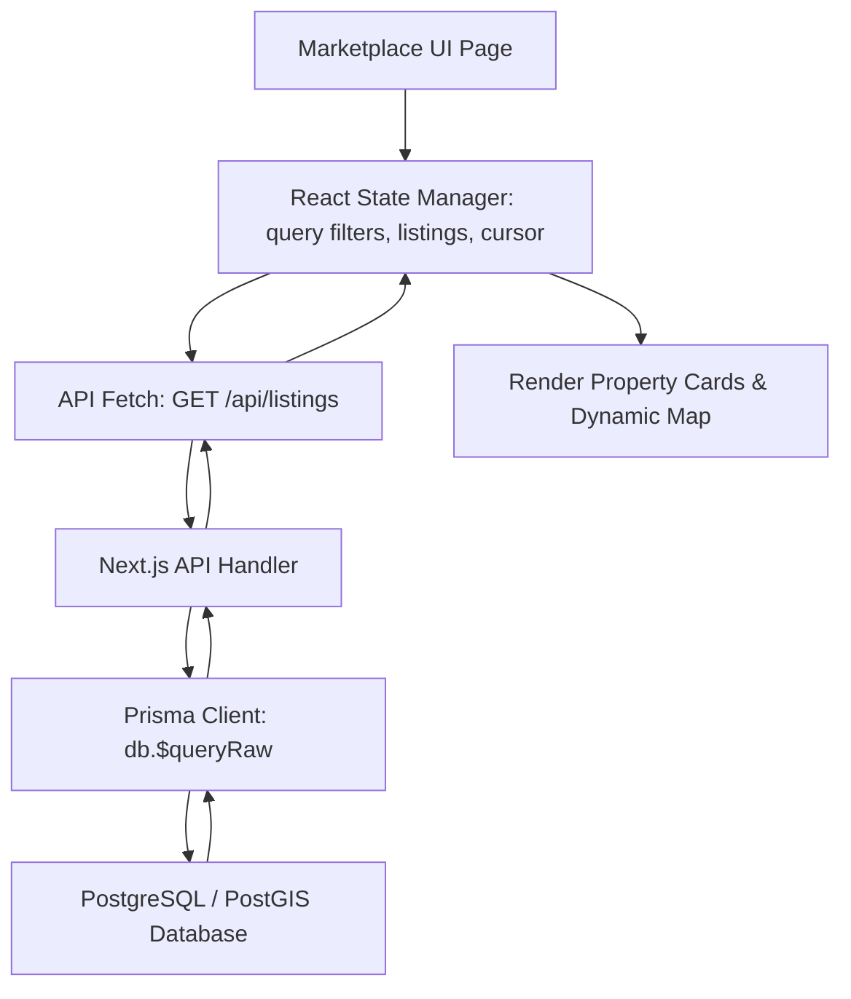

# Property Feed & Search System Design Specification
## Technical Architecture & Scaling Strategy

This document outlines the architecture, data structures, and database optimization strategies for the property search and listing feed system in the real estate marketplace.

---

### 1. Feed Architecture

The property feed displays active listings in an index-friendly, highly performant listing stream.



#### Component Breakdown:
* **`MarketplaceDashboard` (Parent component, `page.tsx`)**: Orchestrates the listing search filter bar, map viewport center state, and paginated feed list.
* **`DynamicMap` (Leaflet Map wrapper)**: Tracks viewport coordinates and triggers search query rebuilds based on bounds changes.
* **`PropertyCard`**: Renders property photos, status badges, price values, and owner detail links.

---

### 2. Search Architecture

The search system handles two separate geospatial query modes:

#### A. Radial (Distance-Based) Search
* Triggered when the user searches "near me" or selects a specific search center and radius.
* **PostGIS Query mechanics**: Uses `ST_DWithin` on the point geography to filter listings within a designated radius (e.g., 5km) and orders the results by geodesic distance using `ST_Distance`.
* **WebView Integration**: Accesses the Android device's physical GPS location using the HTML5 Geolocation API (`navigator.geolocation.getCurrentPosition`) and updates the search coordinates.

#### B. Viewport (Bounding Box) Search
* Triggered when the user drags or zooms the interactive Leaflet map.
* **PostGIS Query mechanics**: Uses the overlap operator `&&` against `ST_MakeEnvelope(west, south, east, north, 4326)` to return only listings currently visible on the user's screen.

---

### 3. Filtering System

All filters are executed server-side at the database layer:

| Filter Type | Data Type | Database Column | SQL Operator / PostGIS Function |
| :--- | :--- | :--- | :--- |
| **Property Type** | `PropertyType` enum | `p.propertyType` | `=` |
| **Listing Status** | `ListingStatus` enum | `p.status` | `=` (Defaults to exclude `DRAFT`) |
| **Price Range** | `Float` | `p.price` | `>=` and `<=` |
| **Area Size** | `Float` (Sqft) | `pp.geom` (Polygon) | `EXISTS` + `ST_Area(pp.geom::geography) * 10.763910` |
| **Geospatial** | `Point` / `Envelope` | `p.geom` | `ST_DWithin` or `&&` (Envelope overlap) |

---

### 4. Pagination Strategy: Cursor-Based

For high-write listing databases, offset-based pagination (`LIMIT` / `OFFSET`) degrades in performance and causes missing or duplicate listings if items are added or deleted between page loads.

#### Cursor Strategy:
* **Sort Key**: Listings are sorted by `createdAt DESC, id DESC` (incorporating `id` UUID as a strict tie-breaker).
* **Cursor Payload**: A Base64-encoded string representing `[createdAt]_[id]`.
  * *Example*: `2026-06-02T03:00:00.000Z_0cdcd376-084b...` $\rightarrow$ `MjAyNi0wNi0wMlQwMzowMDowMFpfMGNkY2QzNzYtMDg0Yi...`
* **Prisma Query Construction**:
  ```sql
  WHERE (p."createdAt" < cursorDate OR (p."createdAt" = cursorDate AND p.id < cursorId::uuid))
  ORDER BY p."createdAt" DESC, p.id DESC
  LIMIT limit + 1;
  ```
* **Page Break Check**: The query requests `limit + 1` listings. If the database returns `limit + 1` items, `hasNextPage` is set to `true`, and the last item is used to formulate the `nextCursor`. The extra item is then popped before returning results to the client.

---

### 5. API Routes

#### GET `/api/listings`
Retrieves properties using active filters and cursor pagination.

##### Query Parameters:
* `cursor` (String, Optional): Base64-encoded pagination cursor.
* `limit` (Int, Optional, Default: 10): Number of listings to retrieve.
* `minPrice` / `maxPrice` (Float, Optional): Filtering bounds for listing price.
* `minArea` / `maxArea` (Float, Optional): Filtering bounds for property area size in sqft.
* `propertyType` (String, Optional): `HOUSE`, `APARTMENT`, `CONDO`, `LAND`, `COMMERCIAL`.
* `lat` / `lng` / `radius` (Float, Optional): Radial search settings (distance in meters).
* `south` / `west` / `north` / `east` (Float, Optional): Bounding box viewport settings.

##### JSON Response Body:
```json
{
  "success": true,
  "message": "Listings retrieved successfully",
  "data": [
    {
      "id": "0cdcd376-084b-4326-8c4d-de1234567890",
      "title": "Luxury Modern Villa in Mantripukhri",
      "description": "Stunning 4 bedroom villa...",
      "price": 15000000,
      "address": "Mantripukhri, Imphal East",
      "propertyType": "HOUSE",
      "status": "ACTIVE",
      "latitude": 24.8436,
      "longitude": 93.945,
      "ownerId": "f7d75b31-e123...",
      "ownerName": "Sarah Jenkins",
      "createdAt": "2026-06-02T03:00:00.000Z",
      "images": ["https://images.unsplash.com/..."],
      "polygon": {
        "type": "Polygon",
        "coordinates": [[[93.944, 24.842], ...]]
      }
    }
  ],
  "pagination": {
    "nextCursor": "MjAyNi0wNi0wMlQwMzowMDowMFpfMGNkY2QzNzYtMDg0Yi...",
    "hasNextPage": true,
    "limit": 10
  }
}
```

---

### 6. Query Optimization

1. **Compound Indexes**:
   - Create a compound index on `status` and `createdAt` to accelerate basic public feeds:
     ```sql
     CREATE INDEX IF NOT EXISTS idx_properties_active_created ON "Property" (status, "createdAt" DESC, id DESC);
     ```
2. **Spatial Indexes**:
   - GIS indexes (`GIST`) are set on `Property.geom` (Point) and `PropertyPolygon.geom` (Polygon) for spatial checks.
3. **Optimized Subqueries**:
   - Using `EXISTS` subqueries for `PropertyPolygon` area evaluation prevents expensive spatial `JOIN` statements when listing feeds are queried without area size filters.

---

### 7. SEO Recommendations

To maximize visibility on search engines for property marketplace listing pages:
* **Server-Side Rendering (SSR)**: Ensure search/feed landing pages are pre-rendered on the server so search engine spiders index actual property text instead of blank skeleton containers.
* **Metadata & Canonical Links**:
  - Dynamically build unique title tags: `"{Property Title} for Sale in {Address} | Heisnam Estate"`.
  - Add descriptive meta tags: `"{Description summary} - view photos, location on map, and spatial valuations."`.
* **JSON-LD Schema**: Inject Google Real Estate Listing structured data scripts:
  ```html
  <script type="application/ld+json">
  {
    "@context": "https://schema.org",
    "@type": "RealEstateListing",
    "name": "Luxury Modern Villa in Mantripukhri",
    "datePosted": "2026-06-02T03:00:00Z",
    "priceCurrency": "INR",
    "price": "15000000",
    "address": {
      "@type": "PostalAddress",
      "streetAddress": "Mantripukhri",
      "addressLocality": "Imphal",
      "addressRegion": "Manipur",
      "postalCode": "795002",
      "addressCountry": "IN"
    }
  }
  </script>
  ```

---

### 8. UI Architecture

* **Infinite Scroll Feed**: Attach an `IntersectionObserver` trigger on the last rendered `PropertyCard`. When visible, hit `/api/listings?cursor={nextCursor}` and append new listings to the React array state.
* **Skeleton Loading Shimmers**: Display placeholder shimmers while fetching new pages to improve Perceived Performance.
* **State Preservation**: Store scroll position and loaded listings in global state or session cache so returning from a detail view doesn't force a full reload.

---

### 9. Caching Recommendations

1. **API Parameter Hashing**:
   - Cache API responses in **Redis** with a key formed by hashing the active query parameters (`lat_lng_radius_price_area_cursor`). Set a time-to-live (TTL) of **15 minutes**.
2. **CDN Static Caching**:
   - Cache property details and image assets on a CDN edge (e.g., Cloudflare) with a long TTL (e.g., 7 days) and purge the cache via API webhooks when listing updates are saved.

---

### 10. Scalability Recommendations

* **Read Replicas**: Direct all search and listing GET traffic to a cluster of read-only database replicas, leaving the primary master database solely for writes (listing creations, edits, and verification updates).
* **Connection Pooling**: Use **PgBouncer** to pool database connection threads, maintaining thousands of parallel web clients without exhausting PostgreSQL resource allocations.
* **Pre-calculated Geometry Medians**: Calculate polygon geodesic areas on insert/update and store the scalar values in a float column `areaSqft` on the `Property` model. This completely eliminates the need for run-time `ST_Area` spatial calculations.
