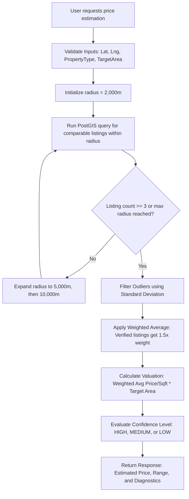

# Geospatial Property Price Estimation Engine
## Technical Specification & Design Architecture (MVP)

This document specifies the design, implementation, and future scaling strategies for the geospatial property price estimation engine built for the real estate marketplace.

---

### 1. Price Engine Workflow

The price estimation engine dynamically calculates property valuations based on nearby comparable listings using spatial proximity and statistical filtering. Below is the end-to-end workflow:



---

### 2. SQL Queries

The engine uses raw SQL spatial queries executed through Prisma to interact with the PostGIS database. The query performs three core spatial operations:
1. **Area Calculation**: Converts property polygon geometries to square feet.
2. **Proximity Search**: Checks if property point coordinate lies within the search radius.
3. **Distance Calculation**: Finds the geodesic distance in meters from the target location.

```sql
SELECT 
  p.id,
  p.title,
  p.price,
  ST_Area(pp.geom::geography) * 10.763910416712 AS "areaSqft",
  p.price / (ST_Area(pp.geom::geography) * 10.763910416712) AS "pricePerSqft",
  ST_Distance(p.geom::geography, ST_SetSRID(ST_MakePoint($1, $2), 4326)::geography) AS "distanceMeters",
  CASE WHEN sv.status = 'APPROVED' THEN TRUE ELSE FALSE END AS "isVerified"
FROM "Property" p
JOIN "PropertyPolygon" pp ON pp."propertyId" = p.id
LEFT JOIN "SellerVerification" sv ON sv."userId" = p."ownerId"
WHERE 
  p."deletedAt" IS NULL
  AND p.status = 'ACTIVE'::"ListingStatus"
  AND p."propertyType" = $3::"PropertyType"
  AND ST_DWithin(
    p.geom::geography, 
    ST_SetSRID(ST_MakePoint($4, $5), 4326)::geography, 
    $6
  )
ORDER BY "distanceMeters" ASC;
```

---

### 3. Radius-Based Search Logic

Rather than doing a single massive search, the engine utilizes a **Proximity Expansion Loop** to search efficiently and minimize database load:
- **Phase 1 (Immediate Proximity)**: Search within a **2 km** radius. If $\ge 3$ listings are found, stop.
- **Phase 2 (Sub-urban Proximity)**: Expand to a **5 km** radius. If $\ge 3$ listings are found, stop.
- **Phase 3 (Regional Proximity)**: Expand to a **10 km** radius. Take all listings found.

This progressive fallback ensures that properties in high-density areas receive high-fidelity local estimations, while rural properties still receive estimation metrics by expanding the search area.

---

### 4. Avg Price Calculation

Verified listings have their details confirmed against government documents, which implies a higher data accuracy. To reward this accuracy, the engine applies a **1.5x weighting multiplier** to verified listings in the average calculation:

* **Verified Listings Weight ($w_v$)**: $1.5$
* **Standard Listings Weight ($w_s$)**: $1.0$

This prevents unverified or potentially spam/outlier listings from skewing the final valuation estimation.

---

### 5. Outlier Filtering Logic

To remove invalid listings (e.g., placeholder prices like `INR 1` or overpriced listings), the engine uses standard deviation to strip out statistical anomalies:

1. **Calculate the Mean ($\mu$)** of the price per sqft of comparable listings.
2. **Calculate the Standard Deviation ($\sigma$)** of the sample.
3. **Set Threshold**: Keep listings where the price per sqft deviates by less than **1.5 standard deviations** from the mean:
   $$\text{Threshold} = 1.5 \times \sigma$$
   $$\text{Keep } x \text{ if } |x - \mu| \le \text{Threshold}$$

If the sample has identical pricing ($\sigma = 0$), filtering is skipped to avoid division errors.

---

### 6. Price Estimation Formula

The valuation uses a weighted average of price per square foot multiplied by the target size, with a $\pm10\%$ confidence range:

#### Estimated Price ($P_{\text{est}}$)
$$P_{\text{est}} = \left( \frac{\sum_{i=1}^{N} w_i \times P_{\text{sqft}, i}}{\sum_{i=1}^{N} w_i} \right) \times A_{\text{target}}$$

Where:
* $w_i$ is the weight of listing $i$ (1.5 if verified, 1.0 if not)
* $P_{\text{sqft}, i}$ is the price per square foot of listing $i$
* $A_{\text{target}}$ is the target area size in square feet

#### Confidence Range
* **Min Estimate**: $P_{\text{est}} \times 0.9$ (10% lower limit)
* **Max Estimate**: $P_{\text{est}} \times 1.1$ (10% upper limit)

---

### 7. Service Architecture

The valuation engine is implemented as a modular service within the application:

* **Database Layer (`schema.prisma` & PostGIS)**: Handles spatial indices and polygon areas.
* **Spatial Service (`spatial.service.ts`)**: General geospatial operations (distance, area, centroid).
* **Price Estimation Service (`price-estimation.service.ts`)**: Handles proximity search, outlier filtering, and pricing math.
* **API Handler (`route.ts`)**: Validates input bounds, handles error wrapping, and returns HTTP responses.

---

### 8. API Endpoints

#### GET `/api/estimate-price`
Retrieves a valuation estimate for a location.

##### Query Parameters:
* `lat` (Float, Required): Latitude (-90 to 90)
* `lng` (Float, Required): Longitude (-180 to 180)
* `propertyType` (String, Required): One of `HOUSE`, `APARTMENT`, `CONDO`, `LAND`, `COMMERCIAL`
* `areaSqft` (Float, Required): Target size of property in sqft (> 0)

##### Example Response:
```json
{
  "success": true,
  "message": "Valuation estimate generated successfully",
  "data": {
    "estimatedPrice": 12500000,
    "priceRange": {
      "min": 11250000,
      "max": 13750000
    },
    "avgPricePerSqft": 5000,
    "radiusMetersUsed": 2000,
    "comparableCount": 4,
    "confidence": "HIGH"
  }
}
```

---

### 9. Optimization Recommendations

1. **Spatial Indexes**: Ensure spatial indices (`GIST`) are set on `Property.geom` and `PropertyPolygon.geom` (already set in `seed.ts`):
   ```sql
   CREATE INDEX IF NOT EXISTS property_geom_idx ON "Property" USING GIST (geom);
   ```
2. **ST_DWithin vs ST_Distance**: Always use `ST_DWithin` inside the `WHERE` clause first. `ST_DWithin` utilizes the GIST spatial index index and avoids expensive distance calculations for points outside the search radius, whereas sorting by `ST_Distance` is performed only on the indexed results.
3. **Caching**: Cache estimation calls with a key formed by `Math.round(lat*1000)/1000` (approx 100m grid) + `propertyType` + `areaSqft` with a TTL of 12-24 hours.

---

### 10. Future Scaling Recommendations

As the platform scales to hundreds of thousands of listings, the MVP engine should evolve:
* **Spatial Partitioning**: Introduce PostGIS table partitioning based on geographic regions (e.g., states/districts) to reduce index tree depth.
* **Materialized Views**: Maintain a materialized view of active listings with pre-calculated `pricePerSqft` and `areaSqft` fields updated via triggers. This eliminates the runtime `JOIN` and geometry area math during price estimation queries.
* **Pre-computed Micro-neighborhood Medians**: Periodically (e.g., every night) run map-reduce jobs to pre-calculate median price-per-sqft grids across regions, allowing $O(1)$ lookup times.
* **Statistical ML Refinement**: Once the listing volume is high enough, transition to a light gradient boosting model (e.g., LightGBM or XGBoost) to incorporate additional features like age of building, number of rooms, and proximity to schools/amenities without adding architectural complexity.
